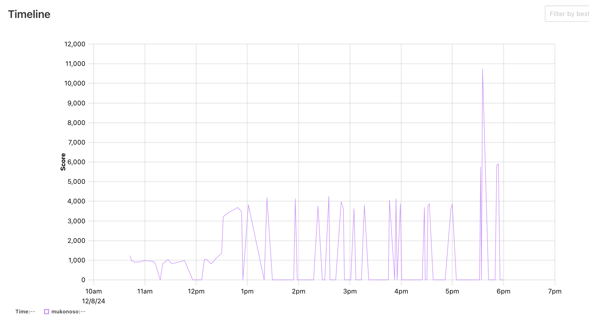

先日の12/8に開催されたISUCONに参加！  
チームはmukonosoとして、[@yamawo](https://x.com/yamawo_123)さんと2人で参加した。  
去年も参加してボロボロだったから、今年こそは…!と意気込んでたけど、今年は内容的にかなり悔しい結果になった。  
来年出るときに備えて、やったことをまとめておく。

<!-- toc -->

## 結果
  
13時頃から17時頃まで、ほとんどスコアを上げられず停滞。

## ログ
### 10:00-10:40 環境構築 & 初回ベンチマーク[1233点]
- ベース環境の構築と初回ベンチを実行。
- 順調に滑り出した…かと思いきや、ここから長い戦いが始まる。

### 10:40-12:00 レギュレーション読み & pproteinの調査[985点]
- ベンチを回しながらレギュレーション読み直し。
- pprotein(Go)からalpを実行できずデバッグに時間を消費。12時前に一旦諦め、次の手へ。

### 12:10 N+1を1つ解消[1036点]
- pprofで消費の多かったAPIのN+1を解消。
- スコア微増で保留。(後にデプロイスクリプトの中で、go buildができていないことに気づく・・・)

### 12:30 いくつかIndex追加[3423点]
- [@yamawo](https://x.com/yamawo_123)さんがいくつかインデックスを追加。
- スコアはややアップして3,000点台に。

### 12:50 キャッシュ追加[0点]
- getLatestRideStatus頻発呼び出しされていたので、インメモリキャッシュ導入を試すも、ベンチが頻繁に落ちるためリバート。
- 細かいインデックスは継続して入れる

### 13:30~ マッチングロジック修正に取り掛かる[0点]
- ベンチのログから満足度がスコアに影響してそうということがわかったので
- ランダム1件取得から距離を考慮して取得するようへの改善を目指す。
- chairs_locationsの最新データから距離が近いridesを選ぶようクエリ変更。
- しかし、ベンチが通らなくなり、リバート→再修正を繰り返し、時間を消耗。

### 15:00 DBを2台目に移行[0点]
- DB分離で性能改善を狙うも、なぜかベンチ失敗。
- 他にも修正が含まれていたので、仕方なく1台構成へ戻す。

### ~17:00 ベンチが落ちる原因を調査
- 修正の度にベンチが落ちる状況が続く。
- 原因特定が難航し、コード理解を深める方向へシフト。これでも特定までできない。
- 一旦、遅いクエリ（ownerGetChairs）対策としてpostInitialize/chairPostCoordinateでTotalDistanceとTotalDistanceUpdatedAtを事前計算し、キャッシュすることに挑戦。
- 焦りから実装ミス多発で大幅に時間ロス。

### 17:30 やっとキャッシュが動く[5378点]
- 事前計算の不具合を修正し、何とかベンチが成功し、5,000点台へ。

### 17:35 2台目のDBを追加[10737点]
- 再度2台目のDBを導入し、ようやく10,000点超え。
- 時間も迫っていたため、ログ・ツールの掃除開始。

### 17:45 お掃除後の実行[0点]
- 不要ファイル・設定の削除後にベンチを回したら、またベンチが失敗…。
- 結局、DBを1台に戻すしかなく、終了時点で再度スコアダウン。
- 振り返ると、初期から存在していたデータの不整合が最後まで足を引っ張った印象。(多分chairをロックする仕組みが必要だった)

## 振り返り
### 全体的に
惨敗だった。全然手が出ず悔しかった。。。
[@yamawo](https://x.com/yamawo_123)さんとお疲れ様会で、焼肉に行ったものの、悔しさで後半は二人で無言に…w

大人になってから、こういうワクワクする場は中々ない！1日通して楽しかった！

来年は絶対気持ちよく飯を食べるぞ！！

### 計測ツール
[pprotein](https://github.com/kaz/pprotein)は神ツールだった。  
計測準備が楽になって、コメントやGitHubコミットも残せて最高。  
ただ、アクセスログ解析でalpを実行できなかったので、次は事前準備をしっかりと。

### 開発環境整備
2人で同一インスタンス・mainブランチで実装してたから、コンフリクト多発。リバートして影響ないようにしたりしてたので、無駄が多かった。  
次回は1人1台環境を用意して、改善できたもののみマージする運用が良さそう。

### ベンチマーカー
ベンチマーカーが頻繁に落ちた。多分既存ロジックでも思い処理を改善していくと、処理が増えて意図しないデータになってしまう感じのはず。  
違和感をそのままにしておいたのがよくなかった。   
根本原因を特定せず場当たり的な改善を重ねると、結局は手戻りを招くので、原因をしっかり追求することが大事。
次回は問題を切り分け、軸となる改善ポイントを明確にして取り組みたい。
