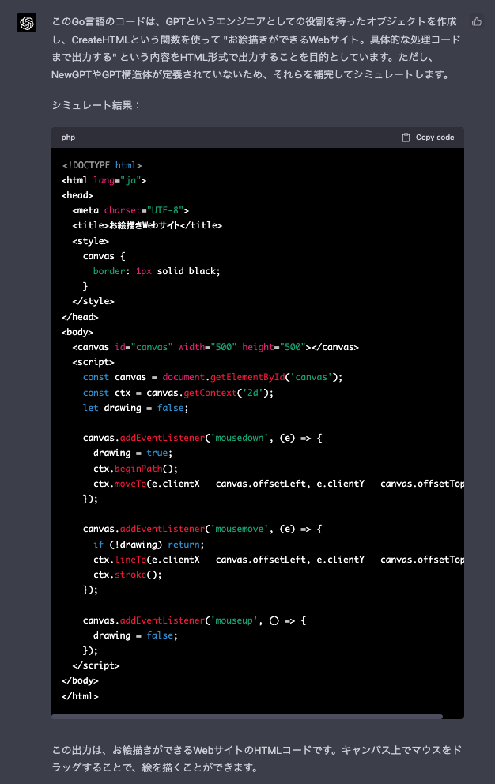
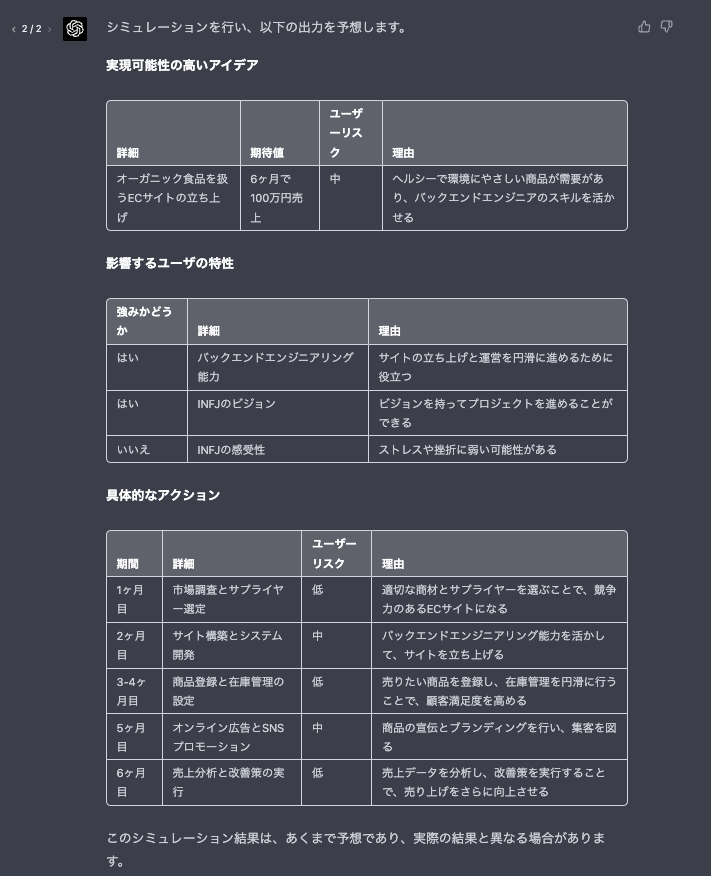

最終ゴールは、目標達成のコンサルティングをしてもらうためのプロンプトを考える

※ 全てGPT-4での実行を想定


## フォーマット
基本的にはプログラムをシミュレートしてもらうようにしてみる
また、個人的にGo言語をよく書くので、Goの文法で擬似コードを入力していく
```markdown
あなたは、高度知能を持ったAIです。
下記のコードの実行をシュミレートし、出力を予想してください。
シュミレート時、必ず以下制約を遵守してください。

## 制約
- 足りない関数や変数は、補完しシュミレートすること
- 補完したコードは出力しないこと
- 実行で得られた結果のみ出力すること

## コード
｀｀｀go
{擬似コードを入力する}
｀｀｀

```


## 簡単にHTMLを作る：お絵描きサイトを作る
以下の擬似コードを入れて実行すると、HTMLコードが出力される
```markdown
import "fmt"
func main() {
  gpt := NewGPT(GPT{Role: "engineer"})
  fmt.Println(gpt.CreateHTML("お絵描きができるWebサイト。具体的な処理コードまで出力する"))
}
```

### 結果
すごい点は、プログラムの内部実行を推測してくれる点です。  
GPT-4はこの推論のクオリティが3.5よりも高いように思います。



## 個人が目標を達成するための具体的なアクションをコンサルティングしてもらう
それでは、今回の記事のゴールのコンサルティングしてもらうプロンプトを擬似コードで実現します

```go
var goal = `6ヶ月で売り上げ100万円上げる方法。また、具体的な商材を決めてほしい。`
var me = "バックエンドエンジニア。16Personalitiesは「INFJ」。ECサイトを立ち上げようとしている"
var gpt = NewChatGPT({Role: "consultant"})

func main () {
  // input: 実現するユーザ、目標
  // output: Goalを実現するための実現可能性の高いアイデア
  idea := gpt.GetOneHighlyFeasibleIdeaByUser(me,goal)

  PrintMarkdownTableByJapanese(idea.detail, idea.Expected, idea.UserRisk, idea.Reason)
  
  // input: アイデア、ユーザ 
  // output: アイデアを実行するにあたって影響するユーザの特性 
  features := gpt.CalculateFeatures(idea,me)
  for _ ,feature := range features {
    PrintMarkdownTableByJapanese(feature.isStrength, feature.detail, feature.reason)
  }
  // input : アイデア、実行するユーザ
  // output: ステップバイステップでゴールに到達するための、アイデアを実行するための具体的なアクション
  actions := gpt.GetSpecificActionStepByStep(idea, me)
  for _ ,action := range actions {
	 PrintMarkdownTableByJapanese(action.period,action.detail, action.UserRisk, action.Reason)
  }
}
```

### 結果

いかかでしょう？実際にユーザの特徴から、リスクや、理由を考えて、具体的なアクションまで出力してくれます。
アクションを細かく分解することで、よりアクションしやすいようになっています。　
