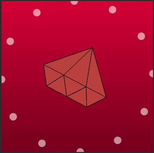

# P5go GoでP5.jsを実行するライブラリ
::github{repo="ryomak/p5go"}


## 背景
Goでクリエイティブコーディングをしたく、ライブラリ作ってみました。

クリエイティブコーディングについてはこちらがおすすめ。とてもワクワクしますね。
https://speakerdeck.com/chobishiba/creative-coding-creating-your-own-world?slide=42

## 作ったもの
GoでP5.jsを実行するライブラリです。
Ruby版を作ってらっしゃる方がいたので、同じ思想で作りました。
https://ongaeshi.hatenablog.com/entry/2023/03/10/021113

## 使い方
https://github.com/ryomak/p5go/tree/main/example
githubに載せています

以下例です。流れをざっくりまとめるとこんな感じです
1.Run関数で、第一引数に、セレクターを指定
2. P5.jsのように、setup関数とdraw関数を実装
3. wasmで実行されるので、`go_ruby_image` に、generateと言う関数を登録 
4. html側で、`go_ruby_image.generate`を呼び出す

### 結果



こちら、デモを載せています  
https://ryomak.jp/art/


### 2のコード
```go
package main

import (
	"syscall/js"
	"math"

	"github.com/ryomak/p5go"
)

const (
    name = "go_ruby_image"
)

func main() {
	js.Global().Set(name, js.ValueOf(map[string]any{
		"generate":    js.FuncOf(Generate),
	}))
	select {}
}

func Generate(this js.Value, args []js.Value) any {
	p5go.Run(args[0].String(),
		p5go.Setup(setup),
		p5go.Draw(draw),
	)
	return nil
}

var angle float64

func setup(p *p5go.Canvas) {
	p.CreateCanvas(300, 300)
	p.NoStroke()
}

func draw(p *p5go.Canvas) {
	// Gradient-like background
	for i := 0; i < 300; i++ {
		r := 220 - float64(i)*0.3
		g := 20 - float64(i)*0.05
		b := 60 - float64(i)*0.1
		if r < 0 { r = 0 }
		if g < 0 { g = 0 }
		if b < 0 { b = 0 }
		p.Fill(r, g, b)
		p.Rect(0, float64(i), 300, 1)
	}

	// Draw Ruby logo
	p.Push()
	p.Translate(150, 150)
	p.Rotate(angle)
	p.Stroke(0)
	for i := 0; i < 5; i++ {
    	r := 236 - float64(i)*10
        g := 97 - float64(i)*5
        b := 88 - float64(i)*5
        if r < 0 { r = 0 }
        if g < 0 { g = 0 }
        if b < 0 { b = 0 }
        p.Fill(r, g, b)
        p.Vertex(-45+float64(i)*10, 45-float64(i)*10)
        p.Vertex(-45+float64(i)*10, -45+float64(i)*10)
        p.Vertex(-10+float64(i)*5, -70+float64(i)*5)
        p.Vertex(65-float64(i)*10, 0)
        p.Vertex(-10+float64(i)*5, 70-float64(i)*5)
    }
	p.BeginShape()
	p.Vertex(-45, 45)
	p.Vertex(-45, -45)
	p.Vertex(-10, -70)
	p.Vertex(65, 0)
	p.Vertex(-10, 70)
	p.EndShape(p5go.CLOSE)

	// Draw internal lines
	p.Line(-45, 45, -10, 25)
	p.Line(-45, 0, -10, 25)
	p.Line(-45, 0, -10, -25)
	p.Line(-45, -45, -10, -25)
	p.Line(-10, 70, -10, -70)
	p.Line(-10, 25, 65, 0)
	p.Line(-10, -25, 65, 0)
	p.Pop()

	// Draw softly glowing, rotating dots around the gem
	for i := 0; i < 12; i++ {
		x := 150 + math.Cos(angle+float64(i)*math.Pi/6)*150
		y := 150 + math.Sin(angle+float64(i)*math.Pi/6)*150
		p.Fill(255, 255, 255, 150)
		p.Ellipse(x, y, 15, 15)
	}

	// Update angle for rotation
	angle += 0.01
}

```


## 最後に


::github{repo="ryomak/p5go"}

