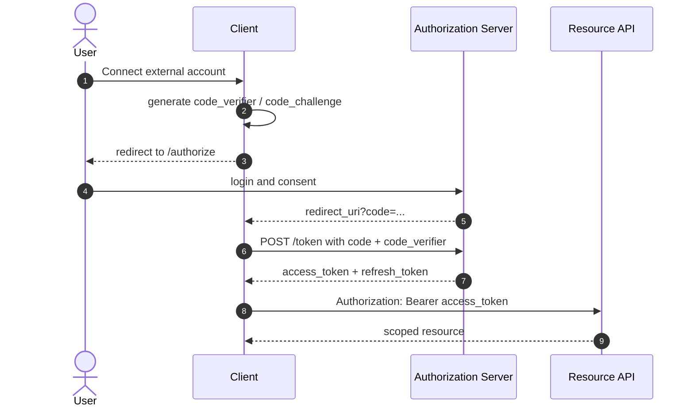
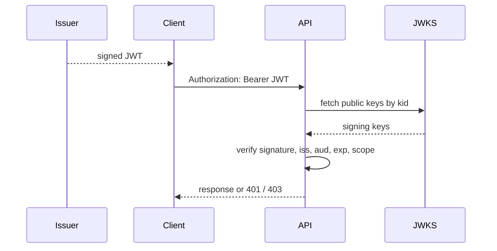
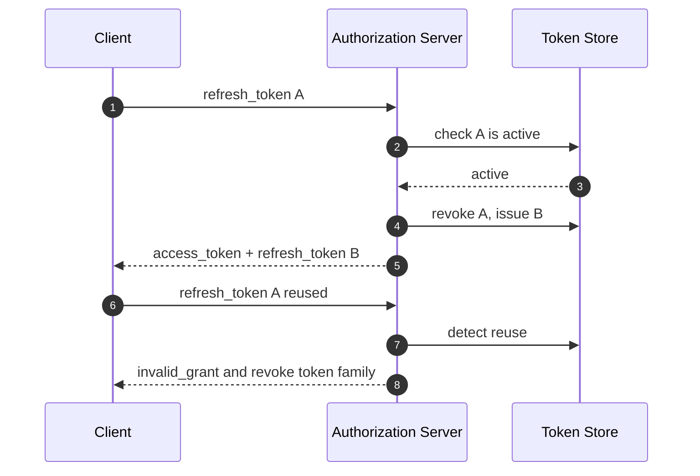

# OAuthと認証認可の基礎

JWT、Cookie、セッションを同じ箱に入れると、設計判断を間違える

---

## 最初に分ける

認証は「誰か」を確認し、認可は「何をしてよいか」を決める

- 認証: ログイン、本人確認、MFA、パスキー
- 認可: 権限、スコープ、ロール、リソース単位の許可
- OAuthは主に「認可」の委譲を扱う

---

## OAuthの位置づけ

OAuthは、パスワードを渡さずに限定的なアクセス権を渡すための仕組み

- ユーザーは認可サーバーで同意する
- クライアントはアクセストークンを受け取る
- APIはトークンの範囲だけを許可する
- 仕様の土台は [RFC 6749](https://www.rfc-editor.org/info/rfc6749/) にある

---

## OAuthの登場人物

OAuthは4者の責務を分けると、一気に読みやすくなる

<div class="diagram">
  <div class="node">Resource Owner<small>ユーザー</small></div>
  <div class="arrow">→</div>
  <div class="node">Client<small>アプリ</small></div>
  <div class="arrow">→</div>
  <div class="node">Authorization Server<small>認可サーバー</small></div>
  <div class="arrow">→</div>
  <div class="node">Resource Server<small>API</small></div>
</div>

---

## Authorization Code Flow

ブラウザを使うアプリでは、コードを一度挟んでトークンを直接露出させない

| 手順 | 受け渡すもの | 目的 |
| --- | --- | --- |
| 1 | 認可リクエスト | ユーザーに同意してもらう |
| 2 | authorization code | フロントに短寿命のコードだけ返す |
| 3 | access token | サーバー側でコードをトークンに交換する |
| 4 | API request | トークンのスコープ内でAPIを呼ぶ |

---

## JWTの位置づけ

JWTはトークンの形式であり、ログイン方式そのものではない

- 署名つきJSONとして、発行者・有効期限・主体・権限を載せられる
- 失効管理が弱いので、短寿命にする設計と相性がよい
- 秘密情報を入れてはいけない。署名は暗号化ではない
- セッションIDの代替に見えるが、運用特性はかなり違う

---

## JWTの中身

JWTは「ヘッダー、ペイロード、署名」の3つをドットでつないだ形式である

<div class="metric-grid">
  <div class="metric"><strong>Header</strong><span>署名アルゴリズムやトークン種別を入れる</span></div>
  <div class="metric"><strong>Payload</strong><span>sub、iss、aud、exp、scopeなどの主張を入れる</span></div>
  <div class="metric"><strong>Signature</strong><span>改ざんされていないことを検証する</span></div>
</div>

---

## トークン設計の比較

失効させたいならサーバー側状態、分散検証したいなら短寿命JWTを選ぶ

| 観点 | セッションID | JWT |
| --- | --- | --- |
| 中身 | ランダムなID | 署名つきclaims |
| 検証 | セッションストアを見る | 署名と有効期限を見る |
| 失効 | しやすい | 工夫が必要 |
| サイズ | 小さい | 大きくなりやすい |
| 向く場面 | Webログイン | API・サービス間連携 |

---

## Cookieの位置づけ

Cookieはブラウザが保存してリクエストに同梱する入れ物である

- サーバーは `Set-Cookie` でブラウザに保存を依頼する
- ブラウザは同じサイトへのリクエストに `Cookie` を送る
- `HttpOnly`、`Secure`、`SameSite` が防御の基本になる
- 詳細は [MDN: HTTP cookies](https://developer.mozilla.org/en-US/docs/Web/HTTP/Guides/Cookies) が実装寄りで読みやすい

---

## Cookie属性の使い分け

ログインCookieは、保存する値より先に属性で守る

| 属性 | 役割 | ログインCookieでの基本 |
| --- | --- | --- |
| `HttpOnly` | JavaScriptから読ませない | 付ける |
| `Secure` | HTTPSでだけ送る | 付ける |
| `SameSite` | CSRFのリスクを下げる | LaxかStrictを検討 |
| `Path` | 送信範囲を絞る | `/`または必要範囲 |
| `Max-Age` | 有効期限を決める | セッション方針に合わせる |

---

## セッションの位置づけ

セッションは、サーバー側に状態を持たせるログイン管理の考え方である

- ブラウザにはランダムなセッションIDだけを渡す
- 権限やユーザー情報はサーバー側のストアで管理する
- 強制ログアウトや権限変更の反映がしやすい
- スケール時はRedisなどの共有ストアか、sticky sessionが必要になる

---

## 攻撃面で見る

どの方式も弱点が違うので、守り方も変わる

| 攻撃・事故 | Cookieセッション | JWT |
| --- | --- | --- |
| XSS | `HttpOnly`で読み取りを抑える | localStorage保存は危険が大きい |
| CSRF | `SameSite`とCSRF tokenで抑える | Authorizationヘッダーなら影響は小さい |
| 漏えい時 | サーバー側で失効しやすい | 短寿命化とローテーションが重要 |
| 権限変更 | 次リクエストで反映しやすい | claimsの鮮度に注意する |

---

## よくある組み合わせ

ブラウザアプリでは、Cookieセッションと短寿命トークンを分けて考える

| 用途 | 向いている方式 |
| --- | --- |
| 通常のWebログイン | Cookie + サーバーセッション |
| SPAから自社API | BFF + HttpOnly Cookie |
| 外部APIの委譲 | OAuth + Access Token |
| サービス間通信 | 短寿命JWTまたはmTLS |

---

## 設計で見るポイント

保存場所、失効方法、攻撃面を先に決めると選択肢が絞れる

- ブラウザに置くならXSS時の被害範囲を見る
- 自動送信されるCookieはCSRFも考える
- JWTは失効より短寿命と再発行で守る
- セッションはサーバー側ストアの可用性が設計の中心になる

---

## まとめ

「何を渡すか」と「どこに状態を持つか」を分けると、認証認可の設計は読みやすくなる

- OAuth: 権限委譲のプロトコル
- JWT: トークンの表現形式
- Cookie: ブラウザ保存と送信の仕組み
- セッション: サーバー側で状態を持つログイン管理

---

## 40分の話し方

概念を先に暗記するより、3つの通信を追うと理解が速い

| 時間 | 扱うこと | ゴール |
| --- | --- | --- |
| 0-8分 | 認証と認可の分離 | 「本人確認」と「許可」を混ぜない |
| 8-20分 | Cookieセッション | 普通のログインの裏側を追える |
| 20-32分 | OAuth + JWT | 外部連携とAPIアクセスを追える |
| 32-40分 | 設計判断 | 自分のプロダクトで選べる |

---

## 通常ログインのシーケンス

Cookieセッションは、ブラウザとサーバーの間に「合言葉」を置く

```mermaid
sequenceDiagram
  autonumber
  actor User
  participant Browser
  participant App as App Server
  participant Store as Session Store

  User->>Browser: ID / Password
  Browser->>App: POST /login
  App->>App: credential check
  App->>Store: create session_id -> user_id
  App-->>Browser: Set-Cookie: sid=...; HttpOnly; Secure; SameSite=Lax
  Browser->>App: GET /dashboard with Cookie
  App->>Store: lookup sid
  Store-->>App: user_id, role, expires_at
  App-->>Browser: authorized page
```

---

## OAuth認可コード + PKCE

OAuthはログイン機能ではなく、「別サービスへのアクセス許可」を受け取る流れである



---

## APIでJWTを使う場面

JWTは「サーバーが署名した主張」をAPI側で検証できる形にする



| 検証する値 | 見る理由 |
| --- | --- |
| `iss` | どの発行者を信じるか |
| `aud` | どのAPI向けのトークンか |
| `exp` | 期限切れではないか |
| `scope` | 実行してよい操作か |

---

## Refresh Token Rotation

長く使う権限は、盗まれた時に検知できる形で更新する



| 状態 | 正常系 | 異常系 |
| --- | --- | --- |
| 初回発行 | refresh token Aを保存 | なし |
| 更新 | Aを使ってBを発行し、Aを失効 | Aが再利用されたら漏えい疑い |
| 失効 | logoutや期限で削除 | 関連トークンをまとめて停止 |

---

## CSRFとXSSの違い

攻撃名で覚えるより、ブラウザが何を勝手にやるかで見る

<div class="matrix">
  <div><h4>CSRF</h4><p>ログイン済みブラウザに、意図しないリクエストを送らせる。Cookieが自動送信される点が攻撃の足場になる。</p></div>
  <div><h4>XSS</h4><p>ページ内で攻撃者のJavaScriptが動く。トークン読み取り、画面操作、API呼び出しが被害になる。</p></div>
  <div><h4>Cookieで守る</h4><p>SameSite、CSRF token、Origin検証、危険操作の再認証を組み合わせる。</p></div>
  <div><h4>JWTで守る</h4><p>localStorage保存を避け、短寿命化し、発行対象と権限範囲を絞る。</p></div>
</div>

---

## BFFパターン

SPAで悩む時は、ブラウザにトークンを持たせない設計が強い

<div class="diagram">
  <div class="node">Browser<small>HttpOnly Cookieだけ</small></div>
  <div class="arrow">→</div>
  <div class="node">BFF<small>sessionを検証</small></div>
  <div class="arrow">→</div>
  <div class="node">Backend API<small>内部token/mTLS</small></div>
</div>

<div class="quote-panel">フロントエンドから見える秘密を減らすほど、XSS時の被害範囲は小さくなる。</div>

---

## 設計演習

<div class="workshop">
  <div class="timebox">5m</div>
  <div class="prompt">
    <p>自社SaaSで「ブラウザ管理画面」「スマホアプリ」「外部API連携」があるとする。</p>
    <p>それぞれ、Cookieセッション、OAuth、JWTをどこで使うかを書き分ける。</p>
  </div>
</div>

---

## 判断チェックリスト

実装に入る前に、この表を埋める

| 問い | 決めること |
| --- | --- |
| 誰が誰を信じるか | issuer、audience、redirect URI |
| 何を許可するか | scope、role、policy |
| どこに保存するか | Cookie、session store、token store |
| どう失効するか | logout、期限、rotation、管理者停止 |
| 何を監査するか | login、consent、token exchange、権限変更 |
